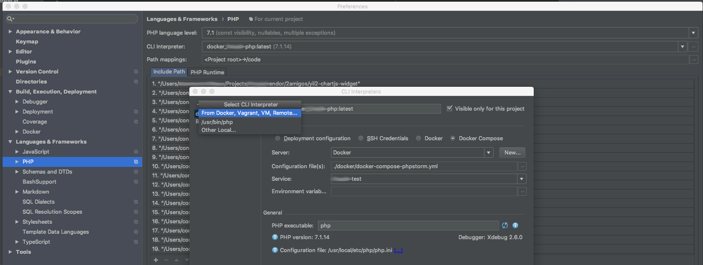
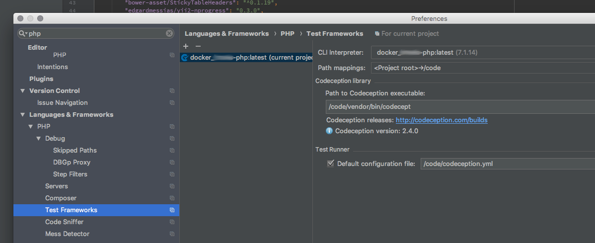

# PHPStorm & Docker

The goal for this tutorial is to help containerize an application
to leverage the tools within PHPStorm (Test Suite, Coverage, etc).

To do this the following things need to happen:

1) Setup Docker for Mac in PHPStorm.
2) Setup Language (PHP in this example) to use a remote interpreter.
3) Fix the paths to match our standard (/code for project code)
4) Setup Tests (PHPUnit or Codeception) to use a special docker-compose file.

We are assuming the following things:

1) Docker compose file exists for the project.
2) The project is already running via (docker-compose up --build)
3) Some small knowledge of Docker

### Setup Docker for Mac in PHPStorm

Head to Preferences and go to `Build, Execution, Deployment -> Docker`. Create a
an item called "Docker" using the daemon option "Docker for Mac".


### Creating an isolated docker-compose for testing.

In order for PHPStorm to run tests without affecting containers. You need to 
create a new container that matches whatever container your code works on.

For example, here a random PHP project `docker-compose-phpstorm.yml` file.

```
version: '2'
services:
    project-test:
        container_name: sourcetoad_project_test
        build: .
        volumes:
            - ../:/code:delegated
        networks:
            - project-internal
            - st-mariadb-101
            - st-redis-32
networks:
    project-internal:
    st-redis-32:
        external:
            name: st-redis-32
    st-mariadb-101:
        external:
            name: st-mariadb-101
```

As you can see, it is a subset of the compose file. It only includes a clone of 
the PHP container, keeping intact the networks, mounts and env file. This allows
the new container to have access to databases and files which may be needed in
the test suite. You can use multiple compose files if you need one for an 
acceptance test container.

If your project requires multiple containers in the testing aspect. Recommend 
creating descriptive container names, like `project-codeception` so you could 
additionally have `project-behat` if needed.

### Setup Docker Container for PHP Language

Head to Preferences and go to `Languages & Frameworks > PHP`. From here we are 
going to click the "..." next to the CLI Interpreter option in order to create a
new "Docker Compose" interpreter. Using the file we created above, we will 
select that one. Once selected, you need to select the container to use. This 
will more than likely be auto-selected for you. 



### Setup Docker Container for PHP Test Framework

Head to Preferences and go to `Languages & Framework > PHP > Test Frameworks`. 
Once here, click the "+" icon in top right to create a new test environment. You
will more than likely select one of the following:

 * PHPUnit by Remote Interpreter
 * Codeception by Remote Interpreter
 * Behat by Remote Interpreter
 * PHPSpec by Remote Interpreter
 
Once you select one, you will need to select the container to run this tool at.
You already created the container and loaded it in the previous steps. So just
select the container that works. Once loaded, you need to put in the file path 
to that binary. In the screenshot below, we are using Codeception so looking
for `/code/vendor/bin/codecept`. The `/code` is what we use to mount our code 
into the container. This pattern may be different depending on lots of factors.

Finally, for this step you need to make sure you specify the configuration file 
for the test framework. The default location may be wrong, in the photo below I
gave the direct path to the configuration like: `/code/codeception.yml`.
 

 
### Setup Test Case to run in IDE
 
Head "Run -> Edit Configurations". Now you need to select the test framework 
that matches the test framework you attached into the container. Since, we used
Codeception, we will continue to use Codeception for this demo.
 
Our goal is to select the "Defined in the Configuration File". No matter the 
tool, if you configured it correctly, we can just use those values and inherit.
 
This demo has made an additional change and requested Codeception to only run 
the "unit" test suite.
 


### Run the Test Suite

Now we should be able to the launch the test suite. Our docker-compose file will
execute, spawning a new "test" container based off our main language container.

This will then proceed to execute the test framework we specified, collecting 
the results and parsing them into the UI. 

This can be shown below: 


With that you have successfully hooked the test suites, while keeping Docker 
inside PHPStorm.


