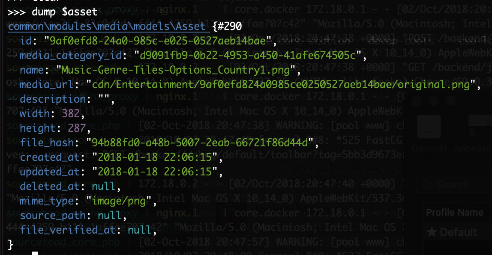

# Yii2 Shell

The Yii shell provides a [REPL](https://en.wikipedia.org/wiki/Read%E2%80%93eval%E2%80%93print_loop) for the application.
This can be useful in experimenting with code or evaluating behavior from within the application.

This is provided by the YiiSoft [yii2-shell](https://github.com/yiisoft/yii2-shell) project.

## Usage

The shell is available via the Yii CLI with `console/yii shell`. This will provide a prompt that evaluates PHP code in the context of a
fully bootstrapped application.  
In common usage, it is likely preferable to access this via one of the Docker containers like `docker exec -it sourcetoad_core_php console/yii shell`.
This allows for Docker based routing to the database container and the Station/Satellite pair.

## Features

### Shell Specific Commands

The shell makes available a number of specific commands. 


`dump` provides a well organized and readable dump.  


An input history is kept locally and can be navigated via the arrow keys, similar to bash.

## Caveats

While classes are autoloaded they must be referenced via full namespaces. If working in a particular namespace this can
be assigned.  
  
`$asset = new common\modules\media\models\Asset()`  
  
versus
  
```php
namespace common\modules\media;
$asset = new models\Asset();
```  
